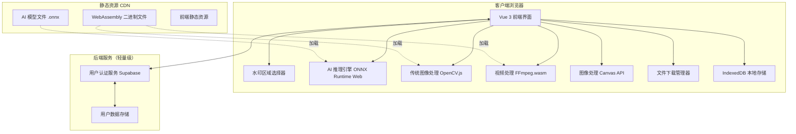

# 系统架构文档

## 架构概述

系统采用纯前端计算架构，核心处理能力完全运行在用户浏览器中。



## 技术栈

| 层级 | 技术 |
|------|------|
| 前端框架 | Vue 3.5 + Vite 8.0 |
| 状态管理 | Pinia 3.0 |
| 路由 | Vue Router 5.0 |
| 样式 | Tailwind CSS 4.3 |
| 类型系统 | TypeScript 6.0 |
| 测试 | Vitest 4.1 + Vue Test Utils |
| AI 推理 | ONNX Runtime Web + WebGPU |
| 视频处理 | FFmpeg.wasm |
| 图像处理 | OpenCV.js WebAssembly |
| 本地存储 | IndexedDB |
| 用户认证 | Supabase Auth（待集成） |

## 组件架构

### 路由结构

| 路径 | 组件 | 描述 |
|------|------|------|
| `/` | HomeView | 首页 |
| `/video` | VideoProcessorView | 视频水印去除 |
| `/image` | ImageProcessorView | 图片处理 |
| `/user` | UserCenterView | 用户中心 |

### 组件层次

```
App
└── AppLayout
    ├── Header（导航栏）
    ├── Main（路由视图）
    │   ├── HomeView
    │   ├── VideoProcessorView
    │   ├── ImageProcessorView
    │   └── UserCenterView
    └── Footer（页脚）
```

### 状态管理

| Store | 职责 |
|-------|------|
| useVideoStore | 视频文件、水印区域、处理状态 |
| useImageStore | 图片文件、处理参数、结果 |
| useTaskStore | 任务队列、进度跟踪 |
| useUserStore | 用户认证、历史记录 |

## 数据流

```
用户操作 → Vue 组件 → Pinia Store → 处理引擎 → 结果存储 → 组件更新
                                    ↓
                              IndexedDB 持久化
```

## 处理引擎架构

### 待集成引擎

1. **AI 推理引擎**：ONNX Runtime Web + WebGPU
   - LaMa 模型：图像修复（去水印）
   - Real-ESRGAN 模型：超分辨率（清晰度增强）

2. **传统图像处理**：OpenCV.js WebAssembly
   - inpainting 算法（Telea/NS）
   - 图片压缩
   - 基础锐化

3. **视频处理**：FFmpeg.wasm
   - 视频解码
   - 逐帧处理
   - 视频编码

## 安全设计

- 所有处理在客户端完成，不上传用户文件到服务器
- 未登录用户数据仅存储在本地 IndexedDB
- 登录用户数据可选择同步到云端
