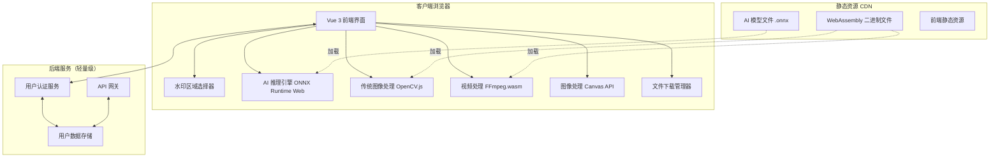

# 在线媒体水印去除工具

Feature Name: 2026-05-11-media-watermark-remover
Updated: 2026-05-11

## Description

基于客户端计算的在线媒体处理工具，利用用户设备的 WebGPU 算力进行视频和图片水印去除、图片压缩和清晰度增强。采用纯前端架构，所有媒体处理均在浏览器中完成，无需服务器 GPU 资源。支持可选用户注册登录，登录用户可保存处理历史记录。系统完全支持移动端浏览器访问，提供响应式界面和触摸手势操作。

## Architecture



**架构说明：**

系统采用纯前端计算架构，核心处理能力完全运行在用户浏览器中：

1. **前端层**：Vue 3 + Vite 构建的单页应用，提供用户界面和交互
2. **AI 推理层**：ONNX Runtime Web + WebGPU，加载预训练的图像修复模型进行水印去除
3. **传统处理层**：OpenCV.js WebAssembly，提供基于 inpainting 的传统去水印算法
4. **视频处理层**：FFmpeg.wasm，在浏览器中完成视频解码、帧处理和重新编码
5. **后端服务**：轻量级认证和用户数据存储，不参与任何媒体处理计算

## Components and Interfaces

### 1. 前端应用 (Vue 3 SPA)

**职责**：用户界面、路由管理、状态管理、组件协调

**核心组件：**

| 组件 | 职责 |
|------|------|
| `App.vue` | 根组件，路由布局，响应式布局控制 |
| `VideoProcessor.vue` | 视频水印去除主界面 |
| `ImageProcessor.vue` | 图片处理主界面（水印/压缩/增强） |
| `WatermarkSelector.vue` | 水印区域选择器（支持多区域、触摸手势） |
| `VideoPlayer.vue` | 视频预览播放器 |
| `ImagePreview.vue` | 图片预览和对比组件 |
| `TaskProgress.vue` | 处理进度显示 |
| `FileUploader.vue` | 文件上传和 URL 输入（支持移动端相册/相机） |
| `OutputSettings.vue` | 输出参数设置（分辨率/质量） |
| `MobileToolbar.vue` | 移动端底部操作栏 |
| `ResponsiveLayout.vue` | 响应式布局容器 |

**状态管理（Pinia Stores）：**

| Store | 职责 |
|-------|------|
| `useVideoStore` | 视频文件、水印区域、处理状态 |
| `useImageStore` | 图片文件、处理参数、结果 |
| `useTaskStore` | 任务队列、进度跟踪 |
| `useUserStore` | 用户认证、历史记录 |

### 2. AI 推理引擎

**技术栈**：ONNX Runtime Web + WebGPU

**模型选择：**

| 模型 | 用途 | 格式 | 大小 |
|------|------|------|------|
| LaMa (Large Mask Inpainting) | AI 去水印 | ONNX | ~50MB |
| Real-ESRGAN | 图片清晰度增强 | ONNX | ~65MB |

**接口：**

```typescript
interface AIInferenceEngine {
  // 初始化 WebGPU 后端
  init(): Promise<void>;
  
  // 执行图像修复（去水印）
  inpaint(image: ImageData, mask: ImageData): Promise<ImageData>;
  
  // 执行超分辨率（清晰度增强）
  superResolve(image: ImageData, scale: number): Promise<ImageData>;
  
  // 获取设备能力
  getDeviceInfo(): { hasWebGPU: boolean; memoryLimit: number };
}
```

### 3. 传统图像处理引擎

**技术栈**：OpenCV.js (WebAssembly)

**接口：**

```typescript
interface TraditionalImageProcessor {
  // 初始化 OpenCV.js
  init(): Promise<void>;
  
  // 基于 inpainting 的水印去除
  removeWatermark(image: ImageData, mask: ImageData, method: 'telea' | 'ns'): Promise<ImageData>;
  
  // 图片压缩
  compress(image: ImageData, quality: number, targetSize?: number): Promise<ImageData>;
  
  // 基础清晰度增强（锐化）
  enhanceSharpness(image: ImageData, strength: number): Promise<ImageData>;
}
```

### 4. 视频处理引擎

**技术栈**：FFmpeg.wasm

**接口：**

```typescript
interface VideoProcessor {
  // 初始化 FFmpeg.wasm
  init(): Promise<void>;
  
  // 加载视频文件
  loadVideo(file: File): Promise<VideoInfo>;
  
  // 处理视频（逐帧去水印 + 重新编码）
  processVideo(params: VideoProcessParams): Promise<Blob>;
  
  // 获取视频帧
  getFrame(timestamp: number): Promise<ImageData>;
}

interface VideoProcessParams {
  watermarkRegions: Array<{ x: number; y: number; width: number; height: number }>;
  algorithm: 'ai' | 'traditional';
  outputResolution: 'original' | '1080p' | '720p' | '480p';
  outputQuality: 'high' | 'medium' | 'low';
}

interface VideoInfo {
  width: number;
  height: number;
  duration: number;
  codec: string;
  fps: number;
}
```

### 5. 用户认证服务

**技术栈**：Supabase Auth 或 Firebase Auth

**接口：**

```typescript
interface AuthService {
  // 邮箱注册
  signUp(email: string, password: string): Promise<User>;
  
  // 邮箱登录
  signIn(email: string, password: string): Promise<User>;
  
  // 第三方登录（Google/GitHub/Apple）
  signInWithProvider(provider: string): Promise<User>;
  
  // 手机号登录（短信验证码）
  signInWithPhone(phone: string, code: string): Promise<User>;
  
  // 退出登录
  signOut(): Promise<void>;
  
  // 获取当前用户
  getCurrentUser(): User | null;
}
```

### 6. 数据存储

**技术栈**：IndexedDB（本地）+ Supabase（云端同步）

**数据模型：**

```typescript
interface ProcessingTask {
  id: string;
  userId: string | null;  // null 表示未登录用户
  type: 'video-watermark' | 'image-watermark' | 'image-compress' | 'image-enhance';
  inputFileName: string;
  outputFileName: string | null;
  outputBlob: Blob | null;  // 本地存储
  status: 'pending' | 'processing' | 'completed' | 'failed';
  progress: number;  // 0-100
  params: Record<string, any>;
  createdAt: Date;
  completedAt: Date | null;
}

interface User {
  id: string;
  email: string;
  createdAt: Date;
  settings: UserSettings;
}

interface UserSettings {
  preferredAlgorithm: 'ai' | 'traditional';
  defaultOutputResolution: string;
  defaultOutputQuality: string;
}
```

## Correctness Properties

### 不变量

1. **内存安全**：处理过程中使用的内存不超过设备可用内存的 80%
2. **WebGPU 可用性**：AI 算法仅在 WebGPU 可用时启用，否则降级到传统算法
3. **视频处理原子性**：视频处理要么完全成功，要么失败并释放所有中间资源
4. **数据隔离**：未登录用户的处理数据仅存储在本地 IndexedDB，不会上传到服务器

### 约束条件

1. **文件大小上限**：视频文件不超过 500MB，图片文件不超过 50MB
2. **浏览器兼容性**：需要支持 WebGPU 的浏览器（Chrome 113+、Edge 113+、Firefox 120+）
3. **并发任务**：同时只允许一个处理任务执行，避免资源竞争
4. **模型加载超时**：AI 模型加载超时时间为 60 秒

## Error Handling

### 错误场景与处理策略

| 错误场景 | 处理策略 |
|----------|----------|
| WebGPU 不可用 | 禁用 AI 算法选项，仅显示传统算法，并提示用户升级浏览器 |
| 内存不足 | 中止处理，释放资源，提示用户关闭其他标签页或使用更小文件 |
| 视频解码失败 | 显示不支持的格式提示，列出支持的格式列表 |
| AI 模型加载失败 | 重试 3 次，失败后提示用户检查网络连接并切换到传统算法 |
| 处理超时（30 分钟） | 中止处理，保存中间状态，提示用户降低输出质量或使用更短视频 |
| 标签页关闭 | 使用 Service Worker 保存任务状态，下次打开时恢复或提示放弃 |
| URL 图片跨域 | 通过 CORS 代理转发请求，或提示用户直接上传图片文件 |
| FFmpeg.wasm 初始化失败 | 提示用户浏览器不支持 WebAssembly，建议使用现代浏览器 |

### 错误恢复机制

```typescript
class ErrorHandler {
  // 带重试的异步操作
  static async withRetry<T>(fn: () => Promise<T>, maxRetries: number = 3): Promise<T>;
  
  // 优雅降级
  static fallbackToTraditional(aiError: Error): void;
  
  // 任务状态保存/恢复
  static saveTaskState(task: ProcessingTask): void;
  static restoreTaskState(taskId: string): ProcessingTask | null;
}
```

## Test Strategy

### 单元测试

| 测试目标 | 工具 | 覆盖范围 |
|----------|------|----------|
| AI 推理引擎 | Vitest + Mock WebGPU | 模型加载、推理调用、结果验证 |
| 传统图像处理 | Vitest + OpenCV.js Mock | inpainting、压缩、锐化算法 |
| 视频处理 | Vitest + FFmpeg.wasm Mock | 视频加载、帧提取、编码输出 |
| 状态管理 | Vitest + Pinia Testing | Store 状态变更、副作用处理 |
| 组件逻辑 | Vue Test Utils | 用户交互、状态绑定、事件处理 |

### 集成测试

| 测试场景 | 方法 |
|----------|------|
| 完整视频去水印流程 | Playwright 端到端测试，上传视频 -> 选择区域 -> 处理 -> 下载 |
| 图片处理完整流程 | Playwright 测试水印去除、压缩、增强功能 |
| 用户认证流程 | Playwright 测试注册、登录、历史记录同步 |
| 错误恢复场景 | 模拟 WebGPU 不可用、内存不足、网络中断 |

### 性能测试

| 指标 | 目标 |
|------|------|
| AI 模型加载时间 | < 10 秒（CDN 缓存后 < 3 秒） |
| 图片去水印处理时间 | < 5 秒（1080p 图片） |
| 视频去水印处理速度 | >= 0.5 倍实时（1080p 视频，WebGPU 加速） |
| 内存使用峰值 | < 设备总内存的 60% |
| 首屏加载时间 | < 3 秒 |

### 浏览器兼容性测试

| 浏览器 | 最低版本 | 测试项 |
|--------|----------|--------|
| Chrome (Desktop) | 113+ | WebGPU、WebAssembly、IndexedDB |
| Edge (Desktop) | 113+ | WebGPU、WebAssembly、IndexedDB |
| Firefox (Desktop) | 120+ | WebGPU 实验性支持 |
| Safari (Desktop) | 17.4+ | WebGPU 实验性支持（标记为不支持时禁用 AI） |
| Safari (iOS) | 17.4+ | 响应式布局、触摸手势、文件选择 |
| Chrome (Android) | 113+ | 响应式布局、触摸手势、文件选择 |

## Implementation Plan

### Phase 1: 项目基础搭建（预计 2 天）

1. 初始化 Vue 3 + Vite 项目
2. 配置 Pinia 状态管理
3. 配置路由（视频处理、图片处理、用户中心）
4. 搭建基础 UI 组件库（使用 Tailwind CSS 或 Naive UI）
5. 实现文件上传和 URL 提取组件

### Phase 2: 图片处理功能（预计 3 天）

1. 集成 OpenCV.js WebAssembly
2. 实现传统去水印（inpainting）
3. 实现图片压缩和清晰度增强
4. 集成 ONNX Runtime Web + WebGPU
5. 加载 LaMa 模型实现 AI 去水印
6. 实现图片预览和对比功能

### Phase 3: 视频处理功能（预计 4 天）

1. 集成 FFmpeg.wasm
2. 实现视频预览播放器
3. 实现多区域水印选择器（基于 Canvas 叠加层）
4. 实现逐帧处理管道
5. 实现视频重新编码和下载
6. 实现处理进度显示和取消功能

### Phase 4: 移动端适配（预计 2 天）

1. 实现响应式布局（Tailwind CSS 断点适配）
2. 添加触摸手势支持（vueuse/gesture）
3. 实现移动端文件选择器（相册/相机集成）
4. 优化移动端 UI 组件（底部导航、触摸友好的按钮尺寸）
5. 测试移动端浏览器兼容性（iOS Safari、Android Chrome）
6. 实现手机号短信验证码登录

### Phase 5: 用户系统（预计 2 天）

1. 集成 Supabase Auth
2. 实现注册/登录/第三方登录
3. 实现 IndexedDB 本地任务存储
4. 实现云端历史记录同步
5. 实现用户设置管理

### Phase 6: 优化与测试（预计 2 天）

1. 性能优化（Web Worker 并发处理）
2. 内存管理优化（及时释放不再使用的帧）
3. 错误处理和用户体验优化
4. 浏览器兼容性测试（含移动端）
5. 端到端测试和修复

## References

[^1]: (Website) - [ONNX Runtime Web 文档](https://onnxruntime.ai/docs/get-started/with-web.html)
[^2]: (Website) - [WebGPU API 文档](https://developer.mozilla.org/en-US/docs/Web/API/WebGPU_API)
[^3]: (Website) - [FFmpeg.wasm 文档](https://ffmpegwasm.netlify.app/)
[^4]: (Website) - [OpenCV.js 文档](https://docs.opencv.org/4.x/d5/d10/tutorial_js_root.html)
[^5]: (Website) - [LaMa 图像修复模型](https://github.com/advimman/lama)
[^6]: (Website) - [Real-ESRGAN 超分辨率模型](https://github.com/xinntao/Real-ESRGAN)
[^7]: (Website) - [Vue 3 文档](https://vuejs.org/)
[^8]: (Website) - [Supabase Auth 文档](https://supabase.com/docs/guides/auth)
